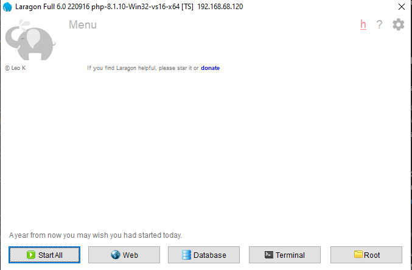

# Desafio-STW

# Sumário

- [Tecnologias utilizadas](#tecnologias-utilizadas)
- [Como Utilizar](#como-utilizar)
- [Um pouco sobre minha experiência](#um-pouco-sobre-minha-experiência)

# Tecnologias utilizadas

- [Laravel](https://laravel.com/)
- [PHP](https://www.php.net/)
- [Vue.js](https://vuejs.org/)
- [Javascript](https://developer.mozilla.org/pt-BR/docs/Web/JavaScript)
- [HTML](https://developer.mozilla.org/pt-BR/docs/Web/HTML)
- [CSS](https://developer.mozilla.org/pt-BR/docs/Web/CSS)
- [MySQL](https://www.mysql.com/)
- [LARAGON](https://laragon.org/download/index.html)
- [Postman](https://www.postman.com/)
---

# Como utilizar

## Ferramentas necessárias

 * Para rodar o projeto, você vai precisar instalar as seguintes ferramentas:
[LARAGON](https://laragon.org/download/index.html) (que vai trazer algumas ferramentas, como o PHP);
* Um editor para trabalhar com o código como [VSCode](https://code.visualstudio.com/);

 ## Rodando no servidor local

- Dentro do painel do "Laragon":
  - Clique em "Start All"
  - 

 - Clone do Projeto

    - Clone este repositório dentro de um pasta que esteja dentro desse caminho: "C:\laragon\www"
    (git clone https://github.com/gabrieldelfurini/todo-stw.git)
    
  - Configure o Banco de Dados
    - No terminal do Laragon, clique em "Database", e abra uma sessão;
    - Dentro da página que abrir (Laragon.MySQL), crie uma base de dados com o nome que desejar;
    - Dentro da pasta "backend" acesse o arquivo ".env", e renomeie o valor de "DB_DATABASE" passando o nome daquele que você criou;
    
 - Inicie o sistema:

    - Dentro de um terminal, inicie o backend:
   cd todo-laravel && php artisan serve

    - Em outro terminal, inicie o frontend:
    cd todo-vue && npm run serve

    Agora abra no navegador o link que aparece no terminal do Vue. Ele deve ser algo como "http://localhost/..."

---

  # Um pouco sobre minha experiência
Esse é um projeto feito para poder **aperfeiçoar minhas habilidades** com algumas das principais tecnologias da STW (Vue, Laravel).

**Foi um grande desafio pra mim, porque durante o desenrrolar do projeto, ocorreram muitos desafios**, principalmente por conta das versões velhas das tecnologias que eu deveria criar esse projeto.

Mas com **bastante persistência** pude terminar ele, conseguindo aprender muitas coisas novas e, **principalmente, aperfeiçoar minhas habilidades de resolução de problemas**, uma vez que passei a maior parte do meu tempo resolvendo eles (que na verdade é o que um desenvolvedor deve ter a competência de fazer)